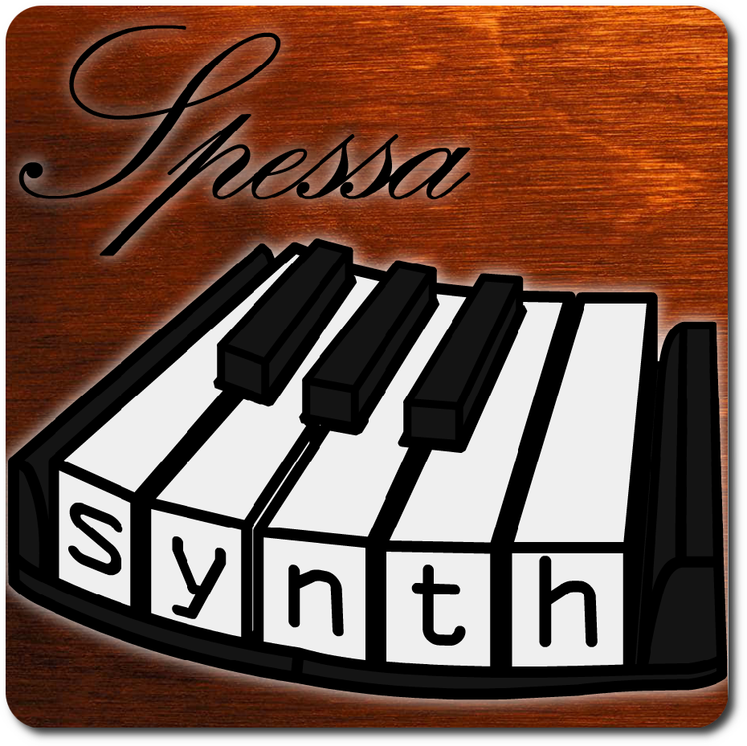

<p align='center'>

</p>

**SpessaSynth** is a SoundFont2-based real-time synthesizer and MIDI library written in vanilla JavaScript.
It’s a powerful and versatile library that allows you to:
- Play MIDI files using SF2/SF3/DLS files
- Write MIDI files
- Write SF2/SF3 files
- Convert DLS to SF2
- [and more!](#easy-integration)

```shell
npm install --save spessasynth_lib
```

<h1 align="center"><a href="https://spessasus.github.io/SpessaSynth/">Live Demo (no download needed!)</a></h1>

<h2 align="center">YouTube Video</h2>
<p align="center">
<a href="https://youtu.be/6rUjjVcMXu8"></a>
</p>

This repository contains both the library and a complete musical web application. See below:

<h1 align='center'>spessasynth_lib</h1>
<p align='center'>A flexible, powerful, and feature-packed SoundFont synthesizer library for the WebAudio API. Comes with the ability to edit MIDIs and SoundFonts!</p>

<h3 align='center'><a href="https://github.com/spessasus/SpessaSynth/wiki/Home">Documentation</a></h3>

<h2 align='center'>Features</h2>

### Easy Integration
- **Modular design:** Easy integration into other projects (load what you need)
- **[Detailed documentation:](https://github.com/spessasus/SpessaSynth/wiki/Home)** With [examples!](https://github.com/spessasus/SpessaSynth/wiki/Usage-As-Library#examples)
- **Easy to Use:** basic setup is just [two lines of code!](https://github.com/spessasus/SpessaSynth/wiki/Usage-As-Library#minimal-setup)
- **No dependencies:** _batteries included!_

### Powerful SoundFont Synthesizer
- Suitable for both **real-time** and **offline** synthesis
- **Excellent SoundFont support:**
  - **Full Generator Support**
  - **Modulator Support:** *First (to my knowledge) JavaScript SoundFont synth with that feature!*
  - **SoundFont3 Support:** Play compressed SoundFonts!
  - **Experimental SF2Pack Support:** Play soundfonts compressed with BASSMIDI! (*Note: only works with vorbis compression*)
  - **Can load very large SoundFonts:** up to 4GB! *Note: Only Firefox handles this well; Chromium has a hard-coded memory limit*
- **Soundfont manager:** Stack multiple soundfonts!
- **DLS Level 1 and 2 Support:** *internally converted to sf2*
- **Reverb and chorus support:** [customizable!](https://github.com/spessasus/SpessaSynth/wiki/Synthetizer-Class#effects-configuration-object)
- **Export audio files** using [OfflineAudioContext](https://developer.mozilla.org/en-US/docs/Web/API/OfflineAudioContext)
- **[Custom modulators for additional controllers](https://github.com/spessasus/SpessaSynth/wiki/Modulator-Class#default-modulators):** Why not?
- **Written using AudioWorklets:** 
  - Runs in a **separate thread** for maximum performance
  - Supported by all modern browsers
- **Unlimited channel count:** Your CPU is the limit!
- **Excellent MIDI Standards Support:**
  - **MIDI Controller Support:** Default supported controllers [here](https://github.com/spessasus/SpessaSynth/wiki/MIDI-Implementation#supported-controllers)
  - **MIDI Tuning Standard Support:** [more info here](https://github.com/spessasus/SpessaSynth/wiki/MIDI-Implementation#midi-tuning-standard)
  - [Full **RPN** and limited **NRPN** support](https://github.com/spessasus/SpessaSynth/wiki/MIDI-Implementation#supported-registered-parameters)
  - Supports some [**Roland GS** and **Yamaha XG** system exclusives](https://github.com/spessasus/SpessaSynth/wiki/MIDI-Implementation#supported-system-exclusives)

- **High-performance mode:** Play Rush E! _note: may kill your browser ;)_

### Built-in Powerful and Fast Sequencer
- **Supports MIDI formats 0, 1, and 2:** _note: format 2 support is experimental as it's very, very rare_
- **[Multi-Port MIDI](https://github.com/spessasus/SpessaSynth/wiki/About-Multi-Port) support:** More than 16 channels!
- **Smart preloading:** Only preloads the samples used in the MIDI file for smooth playback (down to key and velocity!)
- **Lyrics support:** Add karaoke to your program!
- **Raw lyrics available:** Decode in any encoding! *(Kanji? No problem!)*
- **Runs in Audio Thread as well:** Never blocks the main thread
- **Loop points support:** Ensures seamless loops

### Read and Write SoundFont and MIDI Files with Ease
#### Read and write MIDI files
  - **Smart name detection:** Handles incorrectly formatted and non-standard track names
  - **Raw name available:** Decode in any encoding! *(Kanji? No problem!)*
  - **Port detection during load time:** Manage ports and channels easily!
  - **Used channels on track:** Quickly determine which channels are used
  - **Key range detection:** Detect the key range of the MIDI
  - **Easy MIDI editing:** Use [helper functions](https://github.com/spessasus/SpessaSynth/wiki/Writing-MIDI-Files#modifymidi) to modify the song to your needs!
  - **Loop detection:** Automatically detects loops in MIDIs (e.g., from _Touhou Project_)
  - **First note detection:** Skip unnecessary silence at the start by jumping to the first note!
  - **[Write MIDI files from scratch](https://github.com/spessasus/SpessaSynth/wiki/Creating-MIDI-Files)**
  - **Easy saving:** Save with just [one function!](https://github.com/spessasus/SpessaSynth/wiki/Writing-MIDI-Files#writemidifile)

#### Read and write [RMID files with embedded SF2 soundfonts](https://github.com/spessasus/sf2-rmidi-specification#readme)
  - **[Level 4](https://github.com/spessasus/sf2-rmidi-specification#level-4) compliance:** Reads and writes *everything!*
  - **Compression and trimming support:** Reduce a MIDI file with a 1GB soundfont to **as small as 5MB**!
  - **DLS Version support:** The original legacy format with bank offset detection!
  - **Automatic bank shifting and validation:** Every soundfont *just works!*
  - **Metadata support:** Add title, artist, album name and cover and more! And of course read them too! *(In any encoding!)*
  - **Compatible with [Falcosoft Midi Player 6!](https://falcosoft.hu/softwares.html#midiplayer)**
  - **Easy saving:** [As simple as saving a MIDI file!](https://github.com/spessasus/SpessaSynth/wiki/Writing-MIDI-Files#writermidi)

#### Read and write SoundFont2 files
  - **Easy info access:** Just an [object of strings!](https://github.com/spessasus/SpessaSynth/wiki/SoundFont2-Class#soundfontinfo)
  - **Smart trimming:** Trim the SoundFont to only include samples used in the MIDI *(down to key and velocity!)*
  - **sf3 conversion:** Compress SoundFont2 files to SoundFont3 with variable quality!
  - **Easy saving:** Also just [one function!](https://github.com/spessasus/SpessaSynth/wiki/SoundFont2-Class#write)

#### Read and write SoundFont3 files
  - Same features as SoundFont2 but with now with **Ogg Vorbis compression!**
  - **Variable compression quality:** You choose between file size and quality!
  - **Compression preserving:** Avoid decompressing and recompressing uncompressed samples for minimal quality loss!

#### Read and play DLS Level 1 or 2 files
  - Read DLS (DownLoadable Sounds) files as SF2 files!
  - **Works like a normal soundfont:** *Saving it as sf2 is still [just one function!](https://github.com/spessasus/SpessaSynth/wiki/SoundFont2-Class#write)*
  - Converts articulators to both **modulators** and **generators**!
  - Works with both unsigned 8-bit samples and signed 16-bit samples!
  - **Covers special generator cases:** *such as modLfoToPitch*!
  - **Correct volume:** *looking at you, Viena and gm.sf2!*
  - Support built right into the synthesizer!

### Export MIDI as WAV
  - Save the MIDI file as WAV audio!
  - **Metadata support:** *Embed metadata such as title, artist, album and more!*
  - **Cue points:** *Write MIDI loop points as cue points!*
  - **Loop multiple times:** *Render two (or more) loops into the file for seamless transitions!*
  - *That's right, saving as WAV is also [just one function!](https://github.com/spessasus/SpessaSynth/wiki/Writing-Wave-Files#audiobuffertowav)*

## Limitations
- Synth's performance may be suboptimal, especially on mobile devices.
- Audio may sometimes sound distored in Chrome, Edge, Brave,
  etc. due to a **[Chromium Bug](https://issues.chromium.org/issues/367304685).**
  I can't do anything about it, only hope that it gets fixed.

### Installation
#### Npm package
```shell
npm install --save spessasynth_lib
```
#### Or
1. Clone this repository.
2. Copy `src/spessasynth_lib` to your project.
3. [Use the library](https://github.com/spessasus/SpessaSynth/wiki/Home)

> [!TIP]
> Looking for a Node.js version? Try [spessasynth_core](https://www.npmjs.com/package/spessasynth_core)!

<h1 align='center'>Web App / Local Edition</h1>
<p align='center'>The complete GUI for spessasynth_lib, allowing remixing, experimenting, and playing MIDIs in the coolest way possible.</p>

<p align='center'>

</p>
<h3 align='center'><a href='https://github.com/spessasus/SpessaSynth/wiki/How-To-Use-App'>Usage Guide</a></h3>
<h2 align='center'>Features</h2>

- **Visualization of the played sequence:** with cool effects like visual pitch bend and note-on effects!
- **Playable keyboard with various sizes:** mobile friendly!
- **Integrated controller for the synthesizer with numerous options:** Edit instruments, controllers, and more!
- **Lyrics support:** Karaoke!
- **Music player mode:** with support for album covers in .rmi files!
- Mobile-friendly UI (_synthesizer performance not optimized for mobile... don't tell anyone!_)
- **Multiple language support:** English, Polish, Japanese
- **`Web MIDI API` support:** Use your physical MIDI devices!
- [WebMidiLink](https://www.g200kg.com/en/docs/webmidilink/) support
- **Numerous exporting options:**
  - Render the MIDI file (modified or unmodified) to .wav
  - Render each channel as a separate .wav file
  - Export the modified MIDI file to .mid
  - Export the trimmed SoundFont to .sf2
  - Export a DLS file to .sf2
  - Or compress it as .sf3!
  - Bundle both as .rmi with metadata such as album cover!
- Comes bundled with a compressed [GeneralUser GS](https://schristiancollins.com/generaluser.php) SoundFont to get you started
- No additional dependencies!

<h3 align='center'>Still not convinced? Check out these screenshots:</h3>

<!--
MARKDOWN VERSION


-->
<p align='center'>
</img>
</img> 
</img>
</img>
</img>
</img> 
</p>

### Installation (Local Edition)
Local edition comes with easier soundfont management than the demo version.

> [!IMPORTANT]
> Firefox is recommended for large SoundFonts due to memory constraints. A decent computer is also recommended for handling large SoundFonts.

[Recommended high-quality SoundFont (better than the built-in one)](https://musical-artifacts.com/artifacts/1176)

**Local Edition requires Node.js**

#### Windows
1. Download the code as a ZIP file and extract, or use `git clone https://github.com/spessasus/SpessaSynth`.
2. Put your SoundFonts into the `soundfonts` folder (you can select SoundFonts in the program).
3. Double-click `start.bat`.
4. Enjoy!

#### Linux
1. Clone the repository:
   ```bash
   git clone https://github.com/spessasus/SpessaSynth
   cd SpessaSynth
   npm start
   ```
2. Put your SoundFonts into the `soundfonts` folder (you can select SoundFonts in the program).
3. Enjoy!

[If you would like to help translate SpessaSynth, please read this guide (and thank you!)](src/website/locale/locale_files/README.md)

**If you like this project, consider giving it a star. It really helps out!**

#### TODO
- Improve the performance of the worklet system
- Potentially port the worklet system to Emscripten
- Enhance the built-in chorus and reverb effects (suggestions welcome!)

### Special Thanks
- [FluidSynth](https://github.com/FluidSynth/fluidsynth) - for the source code that helped implement functionality and fixes
- [Polyphone](https://www.polyphone-soundfonts.com/) - for the soundfont testing and editing tool
- [Meltysynth](https://github.com/sinshu/meltysynth) - for the initial low-pass filter implementation
- [RecordingBlogs](https://www.recordingblogs.com/) - for detailed explanations on MIDI messages
- [stbvorbis.js](https://github.com/hajimehoshi/stbvorbis.js) - for the Vorbis decoder
- [OggVorbisEncoder](https://github.com/higuma/ogg-vorbis-encoder-js) - for the MIT Vorbis encoder
- [Composers](https://github.com/spessasus/spessasynth-demo-songs#readme) - for the demo songs
- [Falcosoft](https://falcosoft.hu) - for help with the RMIDI format
- [Christian Collins](https://schristiancollins.com) - for the bundled GeneralUserGS soundfont
- **And You!** - for checking out this project. I hope you like it :)

### Major Releases
- [0.0.1](https://github.com/spessasus/SpessaSynth/commit/bc5c6516ae7edc94656b5df75d254a29280caa18) - Initial release
- [1.0.0](https://github.com/spessasus/SpessaSynth/commit/45c23d1c2906b2dec202c0533a9737bd1fa6b3c4) - Removed the 2-sample limit
- [2.0.0](https://github.com/spessasus/SpessaSynth/commit/350e4db90210375da27e393393df743be2137d59) - Implemented the worklet system and added support for modulators
- [3.0.0](https://github.com/spessasus/SpessaSynth/commit/b7f9e382a2f62eef462755ac9ebfe603663e4106) - Moved to audioWorkletGlobalScope for offline audio rendering

### License
Copyright © 2024 Spessasus. Licensed under the MIT License.

> [!IMPORTANT]
> Please note that the bundled [stbvorbis_sync.js](https://github.com/spessasus/stbvorbis_sync.js) is licensed under the Apache-2.0 license.
> The license and the file can be found in the `externals` folder in the spessasynth_lib directory.
